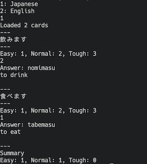

# SRS

A simple SRS app that reads cards from directories and markdown
files as cards.

## Roadmap

#### V1: done
- Read cards from directories
- Randomly schedule and ask cards

#### V2
- Use some scheduling algorithm (eg. SM2)
- Save card stats locally (eg. SM2's card stats)
